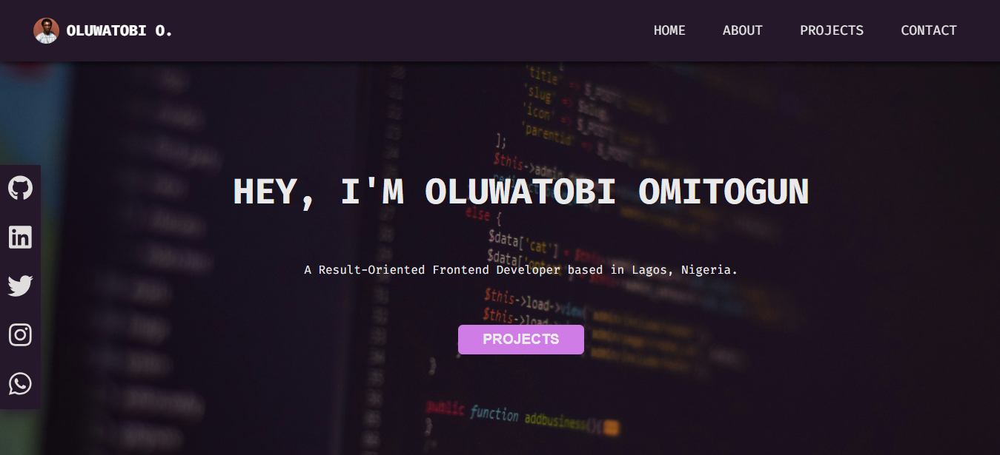

# Oluwatobi Personal Portfolio Website

This is a personal portfolio website created using ReactJs and the contact form powered by [Formspree.io](https://formspree.io).


## Author

- [@iBotayo](https://www.github.com/iBotayo)

## Screenshots




## Tech Stack

**Client:** ReactJs, [Font Awesome](https://fontawesome.com), React Toastify

**Server:** [Formspree.io](https://formspree.io)


## Run Locally

Clone the project

```bash
  git clone https://github.com/iBotayo/Oluwatobi-portfolio
```

Go to the project directory

```bash
  cd my-project
```

Install dependencies

```bash
  npm install
```

Start the server

```bash
  npm run dev
```


## Deployment

To deploy this project run

```bash
  npm run build
```


